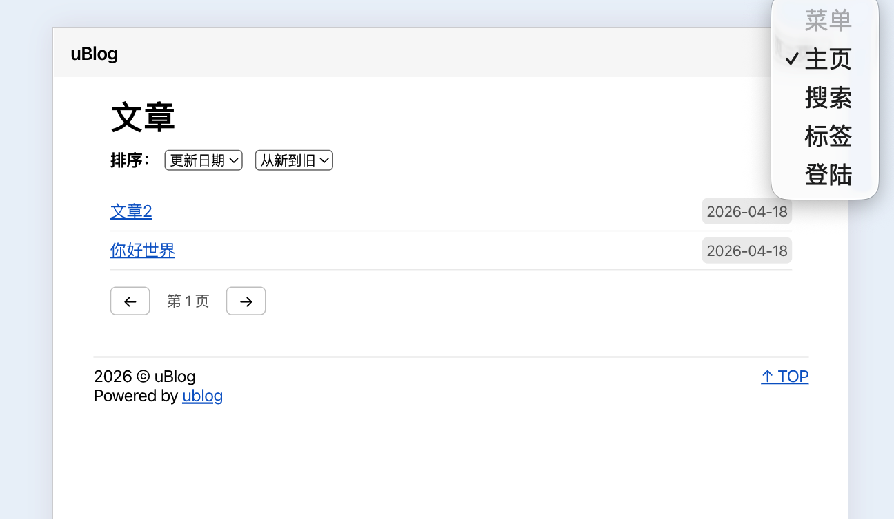
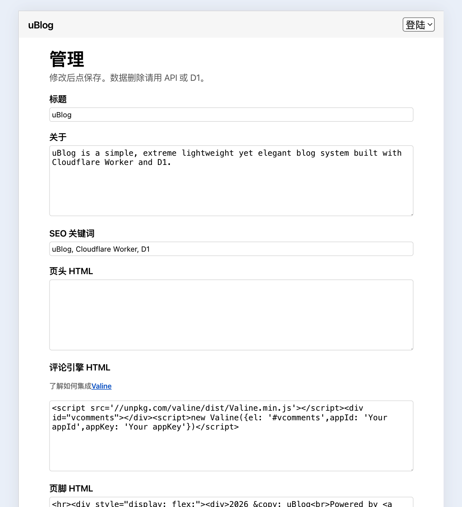

# uBlog

基于 **Cloudflare Workers + D1** 的极简博客 CMS：单文件 Worker（[`worker.js`](./worker.js)）即可完成站点渲染、REST API、配置管理与 Markdown 写作流程。面向个人开发者与小团队，强调轻量、可定制与低维护成本。

仓库内另含产品展示页 [`landing/`](./landing/)（静态 HTML/CSS/JS）与系统设计说明 [`design.md`](./design.md)。线上 Worker 还会在首次请求时自动建表并注入默认 `config`（无需在 SQL 字面量中硬编码复杂 HTML）。

## demo

---

## 特性概览

- **REST API**：文章、标签、站点配置的完整读写与检索（见下文 [# API](#api)）。
- **文章上锁**：正文访问密码仅存 SHA-256 哈希；未带密钥时返回可识别的锁定状态，供前端 `prompt` 解锁。
- **可扩展评论**：在 `config.comment` 中嵌入 Valine / Waline 等脚本，与文章页组装。
- **沉浸式 Markdown 写作**：`/new`、`/edit` 使用 EasyMDE；文章页使用 marked 渲染。
- **高度可定制**：`header`、`footer`、自定义 404 HTML、菜单 JSON、favicon 等。
- **管理员设置**：`/admin` 可视化维护全站配置（Basic 登录后保存）。
- **部署友好**：D1 绑定名为 `DB`；环境变量仅需管理员账号，可选 API 令牌。
- **体积累计**：核心为 **两张表**；前后端代码量级与产品页描述一致（约 **&lt;50K** 级别）。

---

## 架构与数据模型

| 层级 | 说明 |
|------|------|
| 运行时 | Cloudflare Workers + D1 |
| 代码形态 | 单 `worker.js`，函数式拆分，路由集中在 `fetch` 中分发 |
| 认证 | HTTP Basic（管理员账号）+ 可选 `Authorization: Bearer`（全站 API 令牌） |
| 跨域 | 对 JSON 与 OPTIONS 返回公开 CORS，便于多端与脚本调用 |

### `config`（单行，`id = 1`）

| 字段 | 含义 |
|------|------|
| `title` | 站点标题 |
| `about` | 站点简介 / description |
| `seo` | meta 关键词 |
| `header` | 注入 `<head>` 附近的额外 HTML（如统计脚本） |
| `comment` | 评论区域 HTML（与 `posts.comments` 开关联动展示） |
| `footer` | 页脚 HTML |
| `favicon` | 站点图标 URL |
| `logo` | Logo URL（预留） |
| `menu` | JSON 字符串：菜单名 → 链接，解析后为对象 |
| `page404` | 自定义 404 正文 HTML |
| `extra` | 扩展 JSON 字符串 |

### `posts`

| 字段 | 含义 |
|------|------|
| `id` | 主键，自增或可指定插入 |
| `title` / `author` / `content` | 标题、作者、Markdown 正文 |
| `created` / `modified` | ISO 时间字符串 |
| `status` | `0` 公开，`1` 草稿（非管理员列表不可见），`2` 软删除 |
| `tags` | 逗号分隔标签字符串 |
| `comments` | `1` / `0` 是否允许评论（与全局 comment 块共同决定是否展示） |
| `hash` | 访问密码的 SHA-256 十六进制；空表示未上锁 |
| `extra` | 扩展 JSON 字符串，默认 `'{}'` |

---

## 环境变量与绑定

| 变量 / 绑定 | 必填 | 说明 |
|-------------|------|------|
| `[[d1_databases]]` 绑定名 `DB` | 是 | 与代码中 `env.DB` 一致 |
| `USERNAME` | 是 | 管理员用户名（Basic） |
| `PASSWORD` | 是 | 管理员密码（Basic） |
| `API_TOKEN` | 否 | 若设置，则除 Basic 外可用 `Authorization: Bearer <token>` 作为写操作与部分读操作的凭证 |
| `DOCS_URL` | 否 | 覆盖 `GET /api/docs` 的跳转目标（默认见下节） |

---

## 本地与部署初始化

1. 在 `wrangler.toml` 中为 Worker 配置 `binding = "DB"` 的 D1 数据库（与 Cloudflare 控制台创建的数据库关联）。
2. **可选**：使用 D1 建表 SQL 初始化（也可不加——**首次请求时 Worker 会自动执行 DDL 并插入默认配置**）。若手动初始化，需包含 `config` 与 `posts` 两张表，且至少 `INSERT OR IGNORE INTO config (id) VALUES (1)`。
3. 设置 `USERNAME`、`PASSWORD`，按需设置 `API_TOKEN`。
4. 部署：`wrangler deploy`（具体命令以你项目中的 Wrangler 版本为准）。

**说明**：设计文档中提到的「全局限流（如 60 RPM）」宜在 Cloudflare 控制台侧配置；Worker 内未实现令牌桶逻辑。

---

## 站点路由（HTML）

以下内容便于理解「不只是 API」——同一 Worker 还输出页面。

| 路径 | 说明 |
|------|------|
| `/`、`/index` | 首页列表，调用 `GET /api/posts` 分页与排序 |
| `/post?id=` | 文章阅读，marked 渲染，锁定文章会提示密码 |
| `/search` | 搜索与按标签过滤（查询 `GET /api/posts`） |
| `/tags` | 标签云（`GET /api/tags`） |
| `/new` | 新建文章（Basic），无查询参数；带 query 会重定向纯净 `/new` |
| `/edit?id=` | 编辑文章（Basic），无 `id` 会重定向到 `/new` |
| `/admin` | 站点配置管理（Basic） |
| `/404`、未知路径 | 自定义或默认 404 HTML |
| `/logout` | 说明如何尝试清除浏览器 Basic 缓存 |
| `/purge` | 返回 401 + `www-authenticate`，配合错误账号请求以刷新凭证缓存 |

---

# API

基路径为你的 Worker 源站，例如 `https://<your-worker>.<subdomain>.workers.dev`。以下路径均**区分大小写**，且以当前 `worker.js` 实现为准。

### 通用约定

- **Content-Type**：写接口请求体须为 `application/json`（否则按空对象解析，易导致校验失败）。
- **响应**：JSON 接口返回 `Content-Type: application/json; charset=utf-8`。
- **CORS**：响应包含 `Access-Control-Allow-Origin: *` 及常用方法与头；`OPTIONS` 预检返回 **204**。
- **认证（写接口：POST/PUT/DELETE 及受保护的读）**
  - **未设置 `API_TOKEN`**：仅接受 **Basic**，`Authorization: Basic base64(USERNAME:PASSWORD)`。
  - **已设置 `API_TOKEN`**：以下二者**任一**通过即可：  
    - `Authorization: Bearer <API_TOKEN>`  
    - 或上述 Basic 管理员凭证。
- **管理员读取草稿**：`GET /api/post` 在文章 `status === 1` 时，仅当请求能通过 `verifyAdmin`（Bearer 或 Basic）时返回；否则与不存在/已删一样返回 404。
- **文章锁定**：带密码的文章在数据库中存 `hash`。请求 `GET /api/post` 时若锁定且未提供正确 `key`，返回 **403** 及正文中的错误码（见各节）。

---

### `GET /api/docs`

- **作用**：HTTP **302** 重定向到在线文档。
- **目标 URL**：环境变量 `DOCS_URL`；若未设置，默认为  
  `https://github.com/zhoulingyu/ublog-cf/blob/main/design.md#api`  
  （可将本仓库 `readme.md` 的 `# API` 段作为你自己的文档替换该默认值。）

---

### `GET /api/posts`

公开。列出**已发布**文章（`status = 0`），支持过滤与分页。

**Query 参数**

| 参数 | 默认 | 说明 |
|------|------|------|
| `kw` | 空 | 关键词；在标题和内容上做 `LIKE %kw%` |
| `tag` | 空 | 在 `tags` 字段上做 `LIKE %tag%`（子串匹配，注意与多标签逗号列表的边界） |
| `sort` | `modified` | `modified` \| `created` \| `random` |
| `order` | `desc` | 仅对 `modified` / `created` 有效：`asc` 或 `desc`。`random` 时忽略顺序，由 SQLite `RANDOM()` 决定 |
| `limit` | `20` | 每页条数，**1–100**（越界会被裁剪） |
| `offset` | `0` | 跳过条数，≥0 |

**200 响应体**：JSON **数组**。每项字段：

`id`, `title`, `author`, `created`, `modified`, `tags`

---

### `GET /api/post`

读取单篇文章正文与元数据。

**Query 参数**

| 参数 | 必填 | 说明 |
|------|------|------|
| `id` | 是 | 文章 ID |
| `key` | 否 | 若文章已上锁，须传明文密码；服务端与储存的 SHA-256 十六进制比对 |

**成功 200**：JSON 对象：

| 字段 | 类型 | 说明 |
|------|------|------|
| `id` | number | 文章 ID |
| `title` | string | 标题 |
| `author` | string | 作者 |
| `content` | string | Markdown 正文 |
| `created` | string | ISO 时间 |
| `modified` | string | ISO 时间 |
| `tags` | string | 逗号分隔标签 |
| `comments` | boolean | 是否允许评论 |
| `extra` | string | 原样或修正为合法 JSON 字符串；解析失败时可能回退为 `'{}'` |

**错误响应**

| HTTP | 条件 | JSON 示例 |
|------|------|-----------|
| 400 | 缺少 `id` | `{"error":"missing id"}` |
| 404 | 不存在、`status=2`、或非管理员访问 `status=1` | `{"error":"not found"}` |
| 403 | 已锁定且未提供 `key` | `{"error":"locked","code":"LOCKED"}` |
| 403 | 密码错误 | `{"error":"wrong password","code":"WRONG_PASSWORD"}` |

---

### `POST /api/post`

创建文章。**需写权限**。

**JSON Body**

| 字段 | 必填 | 说明 |
|------|------|------|
| `title` | 是 | 标题 |
| `author` | 是 | 作者 |
| `content` | 是 | Markdown 正文 |
| `id` | 否 | 若提供：先 `INSERT OR IGNORE` 该 ID；若因唯一约束未插入成功返回 **409** |
| `created` | 否 | ISO 字符串；默认当前时间 |
| `tags` | 否 | 字符串 |
| `comments` | 否 | 默认允许；`false` 或 `0` 为关闭 |
| `key` | 否 | 若为非空字符串，对其做 SHA-256 后写入 `hash` |
| `status` | 否 | 整数，默认 `0` |
| `extra` | 否 | 对象或字符串；对象会被 `JSON.stringify` |

**200**：`{"ok":true,"id":<number>}`（`id` 为新建或指定成功的 ID）

**401**：`{"error":"unauthorized"}`

**400**：如缺少必填字段、`id` 非数字等。

**409**：`{"error":"insert ignored or failed"}`（指定 `id` 已存在时被忽略）

---

### `PUT /api/post`

更新文章。**需写权限**。

**JSON Body**

| 字段 | 必填 | 说明 |
|------|------|------|
| `id` | 是 | 文章 ID |
| `title` | 否 | 不传则保持原值 |
| `author` / `content` / `created` / `tags` / `comments` / `status` / `extra` | 否 | 同上，`comments` 与 `extra` 规则与 POST 类似 |
| `key` | 否 | **若 JSON 中存在键 `key`**：`null` 或 `""` 清空密码哈希；非空则更新为新哈希。**若完全不包含 `key` 键，则不修改原哈希。** |

`modified` 始终自动设为当前时间。

**200**：`{"ok":true,"id":<number>}`

**404**：`{"error":"not found"}`

---

### `DELETE /api/post`

软删除：**将 `status` 更新为 `2`**，并更新 `modified`。**需写权限**。

**JSON Body**

| 字段 | 必填 |
|------|------|
| `id` | 是 |

**200**：`{"ok":true}`

---

### `GET /api/tags`

公开。从所有**已发布**文章（`status = 0`）收集标签，逗号拆分、去重、排序。

**Query 参数**

| 参数 | 说明 |
|------|------|
| `kw` | 可选；若提供，仅选取 `tags LIKE %kw%` 的行再解析 |

**200**：JSON **字符串数组**，已按字典序排序。

---

### `GET /api/config`

公开。返回当前站点配置，方便前端消费。

**200**：JSON 对象字段与内部存储对应关系：

| 字段 | 说明 |
|------|------|
| `title`, `about`, `seo`, `header`, `comment`, `footer`, `favicon`, `logo` | 字符串 |
| `menu` | **对象**（由库中 JSON 解析） |
| `404` | 自定义 404 HTML（注意键名为数字开头的字段在 JSON 中为合法键） |
| `extra` | **对象**（由 `extra` 字段解析） |

---

### `PUT /api/config`

合并更新配置。**需写权限**。未给出的字段保留原值。

**JSON Body（全部可选）**

| 字段 | 说明 |
|------|------|
| `title` / `about` / `seo` / `header` / `comment` / `footer` / `favicon` / `logo` | 字符串 |
| `menu` | 对象或 JSON 字符串 |
| `404` 或 `page404` | 二者任一可用；内部写入 `page404` 列 |
| `extra` | 对象或字符串 |

**200**：`{"ok":true}`

---

## LICENSE

MIT